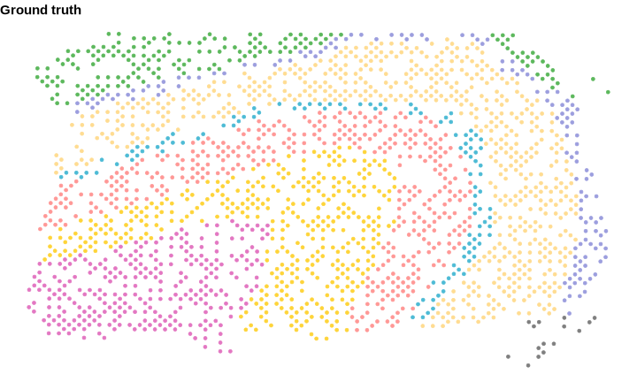
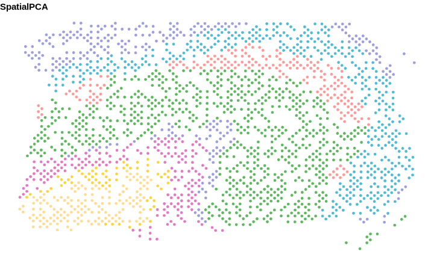
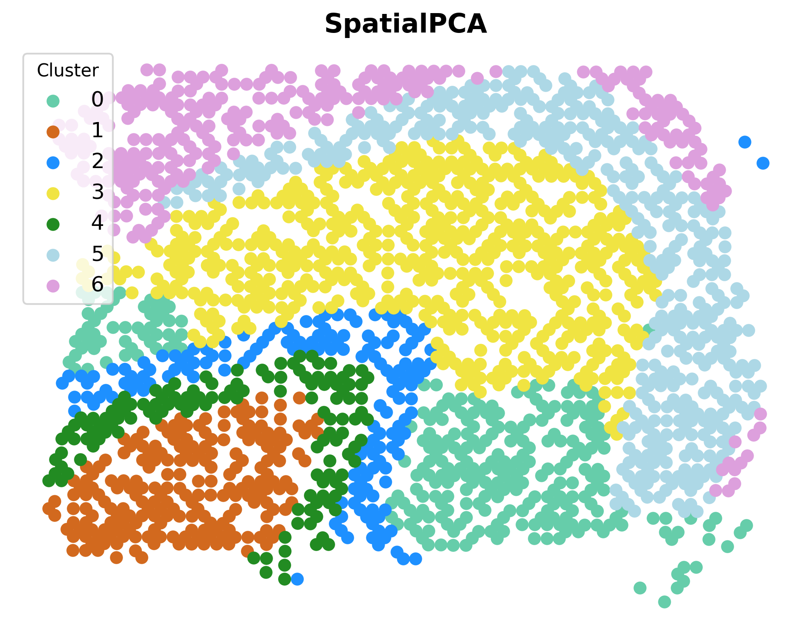
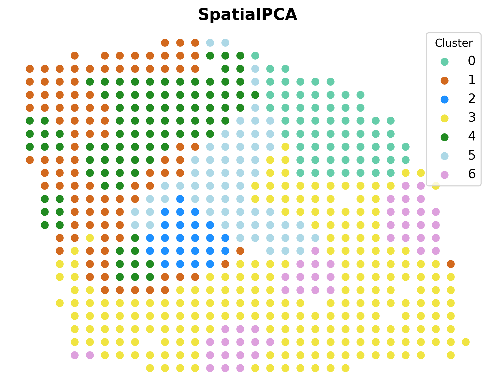

This is a Python implement for SpatialPCA Spatially aware dimension reduction for spatial transcriptomics:

- Authors: Lulu Shang and Xiang Zhou
- Original Implementation: https://github.com/shangll123/SpatialPCA?tab=readme-ov-file
- Paper: https://www.nature.com/articles/s41467-022-34879-1#Sec31

## Setup

- Pre-requirement for Python

```
matplotlib==3.8.4
numpy==2.2.3
scikit_learn==1.4.2
scipy==1.15.2
pyreadr==0.5.3
```

- Pre-requirement for R

```
library(devtools)
install_github("shangll123/SpatialPCA")
```

- Download raw data

The data for `DLPFC` could be downloaded from https://drive.google.com/drive/folders/1ve4MqQU9zswmFEWArx_YILhMfjn0oeK5.

The data for `Breast Tumor` could be downloaded from https://drive.google.com/drive/folders/1sBoEFF5rmBNKVz_wIEbDiZN0bP_xtb_F

After downloaded all data, move them to `raw_data` folder. 


## Run

We use the example from official tutorial https://lulushang.org/SpatialPCA_Tutorial/DLPFC.html. Specially, we select `DLPFC` and `Breast Tumor` two dataset for testing due to its small data size. 

- To get the result from original R implement, we run `spa_PCA_r/breast_tumor.Rmd` and `spa_PCA_r/DLPFC.Rmd` using R. It will output the visualization result in `fig` folder. 

- To get the result with Python implement, just run the jupyter notebook`Spatial_PCA.ipynb`. The result also could be found in  `fig` folder. 


## Result

- The original distribution for `DLPFC`:



- The SpatialPCA embedding using **R** for `DLPFC`:



- The SpatialPCA embedding using **Python**  for `DLPFC`:



- The SpatialPCA embedding using **R** for `Breast Tumor`:


- The SpatialPCA embedding using **Python**  for `DLPFC`:



## Structure

The structure and instructions of this project

```
SpaPCA_python
├─ README.md
├─ Spatial_PCA.ipynb: main python code
├─ fig: result figure
│  ├─ ...
├─ pro_data: pro-precessed data for python input
│  ├─ DLPFC
│  │  ├─ location_dlpfc.rds
│  │  ├─ norm_exp_dlpfc.rds
│  │  └─ truth_dlpfc.rds
│  └─ breast_tumor
│     ├─ tumor_data.rds
│     └─ tumor_location.rds
├─ raw_data: raw data for R input
│  ├─ DLPFC
│  │  ├─ ...
│  └─ breast_tumor
│     └─ ...
├─ requirements.txt
├─ spaPCA_py
│  ├─ SpatialPCA_EstimateLoading.py
│  ├─ SpatialPCA_SpatialPCs.py
│  ├─ SpatialPCA_buildKernel.py
│  ├─ __init__.py
│  ├─ env_py: saved parameters of python
│  │  └─ ...
│  └─ utilis.py
└─ spa_PCA_r
   ├─ DLPFC.Rmd
   ├─ DLPFC.nb.html
   ├─ breast_tumor.Rmd
   ├─ breast_tumor.nb.html
   └─ env_rds
      ├─ saved parameters of R

```

